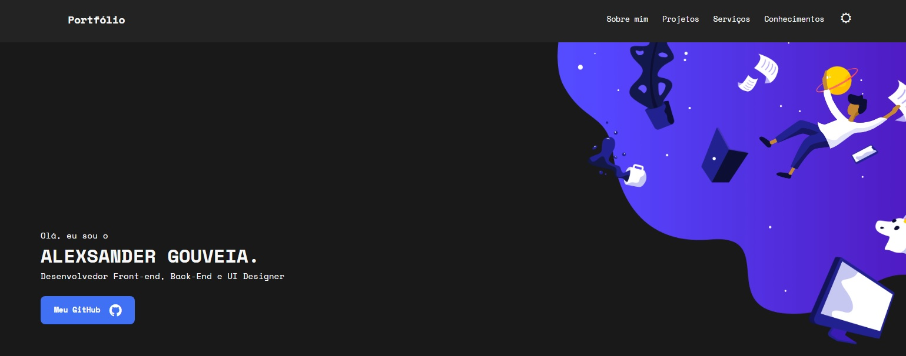

# 🍣 Meu Portfólio 

## 🖥 Visualização

## 🌳 Projeto 
Portfólio criado com o intuito de mostrar meus recentes e futuros projetos ao decorrer da minha carreira. 

## 📚 Seções
O site é composto por 5 seções diferentes:

- **Seção Header:** Nele temos um avatar do meu github e um breve apresentação;
- **Seção Sobre Mim:** Nessa seção tenho um apresentação de um avatar só que andando e uma descrição dizendo sobre mim;
- **Seção Projetos:** Apresenta alguns projetos desenvolvidos e com link direto para os respectivos códigos no GitHub;
- **Seção Serviços:** Exibe através de cards os diferentes serviços em que possuo conhecimentos;
- **Seção Conhecimentos:** Nele apresentamos meus conhecimentos em algumas linguagens como o foco no front-end;

## 🛠 Tecnologias utilizadas
Para o desenvolvimento deste site utilizei as seguintes tecnologias:
- Visual Studio Code;
- HTML5;
- JavaScript;
- SASS (e convertido para CSS3);
- JQuery;

## 📌 Ajustes e melhorias
O site ainda está em desenvolvimento e as próximas atualizações serão voltadas nas seguintes tarefas:

- [x] Adicionar Dark Mode (tema escuro); 
- [x] Efeito flutuante;
- [x] Animação no menu;  
- [x] Responsividade; 
---
